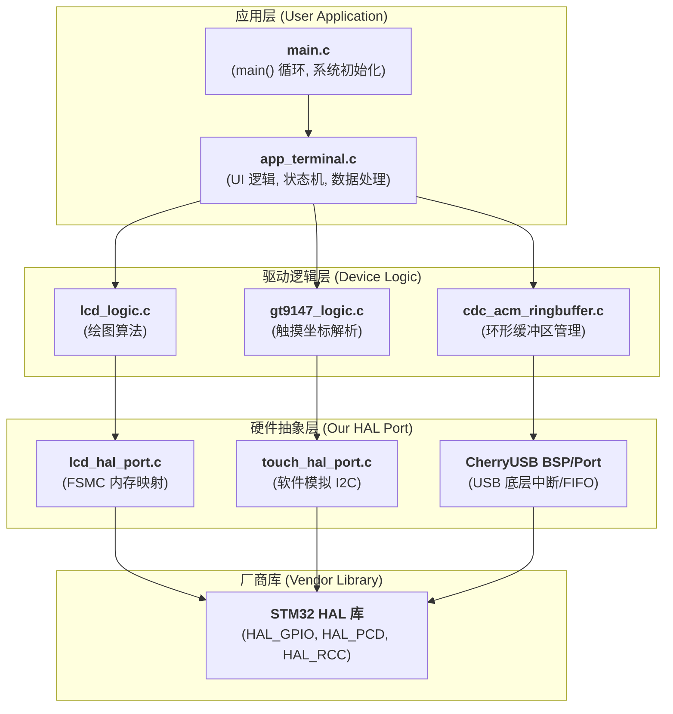

# STM32 触控串口终端 (Serial Touch Terminal)

本项目将一块 STM32F407ZGT6 开发板转变为一个功能丰富的、带图形界面的串行通信终端。它通过 USB 虚拟串口 (CDC) 与PC机通信，并利用 FSMC 驱动的 LCD 显示屏和 GT9147 触摸屏实现了一个完整的自定义键盘和交互式UI。

该项目最大的特点是其**高度解耦的软件架构**，将应用逻辑、驱动逻辑和硬件抽象层完全分离，使其易于维护、移植和扩展。

## 📸 演示

*(强烈建议：在此处插入一张您的开发板运行本项目的照片或GIF动图)*

`[Image or GIF of the terminal UI in action]`

## ✨ 主要功能

* **USB 虚拟串口 (CDC)**: 基于 `CherryUSB` 协议栈实现，与PC（Windows/Linux/Mac）即插即用，无需驱动。
* **双向数据日志**: 在LCD上分为“接收区”和“发送区”，使用高效的**滚动日志**算法，无闪烁刷新。
* **全功能触控键盘**: 实现了 `A-Z`, `0-9` 字母数字键, `Backspace` 和 `SEND` 键，用于自定义数据发送。
* **高级触摸逻辑**:
    * **抬起触发**: 仅在手指按下并抬起后才触发按键，防止误触。
    * **竞态条件修复**: 实现了 `RELEASE_DEBOUNCE_FRAMES` 防抖逻辑，完美解决硬件报告延迟与软件高速轮询的冲突。
* **数据存储与管理**:
    * `Store RX/TX`: 将最后一条收发日志存入存储槽（共4个）。
    * `Query RX/TX`: 在日志窗口中显示所有已存储的数据。
    * `Clear RX/TX`: 清空对应的存储槽。
* **分包数据处理 (高级功能)**:
    * **分包发送**: 一键将长数据（`ThisIsALongData...`）按8字节数据包连续发送。
    * **分包接收**: 自动重组以 `START` 开始、以 `END` 结束的分包数据，并显示完整长字符串。
* **非阻塞式调度**: 采用 `while(1)` 合作式轮询调度，`HAL_Delay(5)` 提供系统节拍，无需 RTOS 即可实现高响应性。

## 🔧 硬件配置

* **MCU**: `STM32F407ZGT6` (或兼容型号)
* **显示**: 800x480 TFT LCD (通过 `FSMC` 16位并行总线连接)
* **触控**: `GT9147` 电容触摸屏 (通过 **软件模拟 I2C** 连接)
* **通信**: `USB OTG FS` 端口 (用于 CDC 虚拟串口)

### 关键引脚连接 (非标准部分)

| 功能 | 引脚 | 描述 |
| :--- | :--- | :--- |
| 触摸 I2C SCL | `PB0` | 软件模拟 I2C 时钟线 |
| 触摸 I2C SDA | `PF11` | 软件模拟 I2C 数据线 |
| 触摸 复位(RST) | `PC13` | 触摸屏硬件复位 |
| 触摸 中断(INT) | `PB1` | 触摸中断输入 (本项目轮询未使用) |

## 🏗️ 软件架构

本项目的核心优势在于其清晰的分层设计，将应用逻辑与底层硬件完全解耦。

- 第4层 (应用层): app_terminal.c 负责所有业务逻辑（如“按下SEND键该做什么”），它只调用第3层。

- 第3层 (驱动逻辑层): 负责设备的功能实现（如“画一个圆”或“扫描坐标”），它 100% 独立于 STM32 硬件，只调用第2层。

- 第2层 (硬件抽象层): _hal_port.c 文件，是我们编写的“转接头”，负责将第3层的抽象请求（如“发送I2C字节”）翻译成第1层的具体硬件操作（如调用 HAL_GPIO_WritePin）。

- 第1C层 (厂商库): ST 提供的 HAL 库。

## 🚀 如何编译与运行
- 环境:

STM32CubeMX (用于配置)

EIDI / STM32CubeIDE / GCC (用于编译)

- 依赖:

本项目已包含 CherryUSB 协议栈源码。

STM32F4 HAL 驱动 (可通过 CubeMX 生成)。

- 步骤:

克隆本仓库。

使用 STM32CubeMX 打开 .ioc 文件（如果需要，请根据您的板卡重新配置 FSMC 和 GPIO 引脚）。

在 CubeMX 中点击 "Generate Code"。

在您选择的 IDE (如 Keil) 中打开项目。

编译并下载到您的 STM32 开发板。

## 🕹️ 如何使用
- 将程序下载到开发板。

- 使用 USB 线连接开发板的 USB_OTG_FS 端口到您的电脑。

- 电脑将自动识别出一个新的 COM 端口（如 COM3）。

- 打开任意串口调试助手（如 PuTTY, Tera Term, MobaXterm 或 Arduino IDE 的串口监视器），连接到该 COM 端口（波特率任意）。

- MCU -> PC: 在开发板的触控键盘上输入 "HELLO" 并按 "SEND"，PC 串口助手应收到 "HELLO"。

- PC -> MCU: 在 PC 串口助手中输入 "STM32 ROCKS" 并发送，开发板的“接收窗口”应显示该消息。

- 测试存储: 测试 Store RX / Query RX / Clear RX 等按钮的功能。

- 测试分包:

- 点击 Send 8-Byte Chunks 按钮，观察 PC 助手连续收到8字节数据包。

- 在 PC 助手依次发送 START，AAA，BBB，END，观察开发板是否能正确重组并显示 AAABBB。

## 📄 许可
本项目基于 MIT License 授权。
